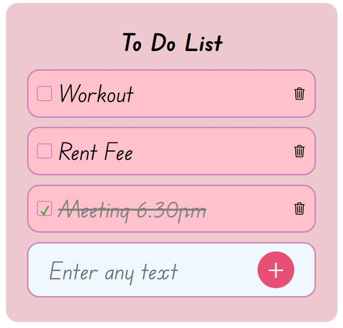

# To-Do List Application

A simple To-Do List application built using Node.js, Express, MongoDB, and EJS. This app allows users to add and delete tasks from a to-do list.

## Table of Contents

- [Features](#features)
- [Installation](#installation)
- [Usage](#usage)
- [Technologies Used](#technologies-used)
- [Screenshot](#screenshot)
- [Contributing](#contributing)
- [License](#license)

## Features

- Add tasks to the to-do list. ✅
- Delete tasks from the to-do list. ❌
- Tasks are stored in a MongoDB database. 🗄️
- The UI is dynamically updated using EJS templates. ✨

## Installation

1. **Clone the repository:**

    ```bash
    git clone https://github.com/your-username/todo-list-app.git
    ```

2. **Navigate to the project directory:**

    ```bash
    cd todo-list-app
    ```

3. **Install the required dependencies:**

    ```bash
    npm install
    ```

4. **Start the MongoDB server.** Ensure that you have MongoDB installed and running on your local machine.

5. **Run the application:**

    ```bash
    node app.js
    ```

6. **Open your web browser and visit:**

    ```
    http://localhost:3000
    ```

## Usage

- **Add a task:** Enter the task in the input field and click the `+` button.
- **Delete a task:** Click the trash icon next to the task you want to delete.

## Technologies Used

- Node.js
- Express
- MongoDB
- EJS (Embedded JavaScript templates)
- HTML/CSS

## Screenshot




## Contributing

Contributions are welcome! Please feel free to submit a Pull Request.

1. Fork the repository.
2. Create a new branch: `git checkout -b feature-branch-name`.
3. Make your changes and commit them: `git commit -m 'Add some feature'`.
4. Push to the branch: `git push origin feature-branch-name`.
5. Open a pull request.

## License

Feel free to use my Project. Happy Coding! :) 
